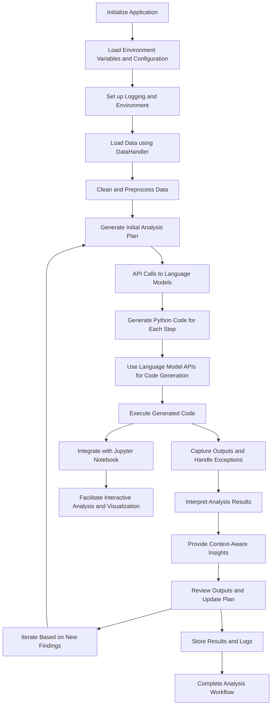

# Automated Data Scientist

### Overview

The **Automated Data Scientist** is an advanced AI-driven solution designed to automate and optimize the entire data science workflow. By leveraging large language models and external APIs, it dynamically plans, executes, and refines data analyses, making it ideal for environments that demand rapid, data-driven decision-making.

This application automates the data preparation, analysis planning, code generation, execution, and result interpretation processes, with the ability to adapt based on intermediate results. It ensures that the most relevant and insightful analyses are performed on the data, significantly reducing the manual effort required for complex data science tasks.

### Key Features

- **Automated Data Handling**: Efficiently loads, cleans, and preprocesses data using configurable settings defined in `config.py`. The `data_handling.py` module facilitates this process by managing data from multiple sources.
- **Dynamic Analysis Planning**: Utilizes language models through API calls to generate an initial analysis plan based on data characteristics. This is achieved by the `analysis_planning.py` module, which communicates with external APIs.
- **Code Generation**: The `code_generation.py` module generates Python code snippets dynamically for each analysis step. It transforms high-level analytical tasks into executable code using language model APIs.
- **Execution Management**: The `execution.py` module executes generated scripts, captures outputs, and manages errors or exceptions. The process is tightly integrated with the `main.py` script, which orchestrates the entire workflow.
- **Result Interpretation**: The `interpretation.py` module provides context-aware interpretations of analysis results, identifying patterns, anomalies, and key insights.
- **Notebook Management**: The `notebook_manager.py` module integrates with Jupyter Notebook environments to facilitate interactive data analysis and visualization.
- **Testing Framework**: Includes comprehensive testing scripts (`test_automated_data_scientist.py` and `test_notebook_manager.py`) to ensure reliability and correctness.
- **Configuration Management**: The `config.py` file allows users to configure environment variables, API keys, and other settings for customized data analysis.
- **Scalability and Adaptability**: Supports flexible limits on analysis steps and can handle varying data sizes, from small exploratory datasets to large-scale production data.

### How It Works

1. **Environment Setup**: The application initializes by loading environment variables, setting up logging, and preparing the environment through the `main.py` script.

2. **Data Handling**:
   - The `DataHandler` class in `data_handling.py` is responsible for loading and preparing the data. It supports different data formats and performs initial cleaning and preprocessing to ensure data is ready for analysis.

3. **Initial Analysis Planning**: 
   - The `AnalysisPlanner` in `analysis_planning.py` generates an initial plan using API calls to external language models. It sends prompts to an AI service (e.g., OpenAI GPT or Anthropic) to determine a sequence of analytical tasks, including EDA, hypothesis testing, and modeling based on the dataset's characteristics.

4. **Code Generation**:
   - The `CodeGenerator` in `code_generation.py` creates Python code dynamically for each analysis step. It uses API calls to convert high-level analytical tasks into executable Python scripts tailored to the data.

5. **Execution of Analysis**:
   - The `CodeExecutor` in `execution.py` runs the generated scripts, captures outputs (results, logs, and visualizations), and handles exceptions. It integrates closely with the `main.py` script to manage the entire execution workflow.

6. **Interpretation of Results**:
   - The `ResultInterpreter` in `interpretation.py` reviews the outputs of each analysis step, providing context-aware interpretations and insights that highlight patterns, anomalies, or other significant findings.

7. **Notebook Management**:
   - The `NotebookManager` in `notebook_manager.py` facilitates integration with Jupyter Notebooks, enabling users to interactively analyze data, visualize results, and refine their analyses.

8. **Adaptive Planning and Execution**:
   - After each analysis step, the application uses the `review_and_update_plan` method in `analysis_planning.py` to refine the analysis plan based on intermediate findings. This iterative process ensures that new insights or anomalies are explored further.

9. **Testing and Validation**:
   - The testing scripts (`test_automated_data_scientist.py` and `test_notebook_manager.py`) provide a comprehensive framework for validating the functionality of all modules, ensuring reliability and robustness.

10. **Configurable Control**:
    - Users can set a maximum number of analyses and configure various parameters in `config.py` to balance thoroughness and efficiency.

11. **Completion and Logging**:
    - Upon completing the analysis, all results, including logs and outputs, are stored in designated directories, providing a clear trail of all activities and findings.

### Benefits

- **Automation and Efficiency**: Minimizes manual intervention by automating data preparation, analysis planning, code generation, and execution.
- **Flexibility and Adaptability**: Dynamically adjusts the analysis process in response to new findings, ensuring that the most relevant data insights are explored.
- **Comprehensive Insights**: Provides in-depth, context-aware interpretations of results, enhancing decision-making speed and quality.
- **Scalability**: Easily configurable to handle datasets of varying sizes and complexity.



### Getting Started

1. **Clone the Repository**:
   ```bash
   git clone https://github.com/yourusername/automated-data-scientist.git
   cd automated-data-scientist
   ```

2. **Set Up a Virtual Environment**:
   ```bash
   python -m venv venv
   source venv/bin/activate  # On Windows, use `venv\Scripts\activate`
   ```

3. **Install Dependencies**:
   ```bash
   pip install -r requirements.txt
   ```

4. **Configure Environment Variables**:
   Create a `.env` file in the project root with the following content:
   ```bash
   OPENAI_API_KEY=your_openai_api_key
   ANTHROPIC_API_KEY=your_anthropic_api_key
   PRODUCTION_CSV_PATH=/path/to/your/production_data.csv
   DATA_DICT_PATH=/path/to/your/data_dictionary.md
   ```

5. **Prepare Your Data**:
   Place your production CSV data and data dictionary in the appropriate locations (or update the paths in the `.env` file).

### Running the Automated Data Scientist

To run the automated data science process:

```bash
python main.py
```

Check the `output` directory for the generated report, visualizations, and other outputs.

### Configuration

You can modify the behavior of the Automated Data Scientist by editing the `config.py` file. This includes settings for data handling, API usage, analysis limits, and output formatting.

### Testing

Run the test scripts to validate the functionality of the project:

```bash
python test_automated_data_scientist.py
python test_notebook_manager.py
```

### Contributing

If you'd like to contribute to this project, please fork the repository and submit a pull request. Ensure that your contributions align with the project’s objectives and adhere to coding standards.

### License

This project is licensed under the MIT License - see the LICENSE file for details.

### Contact Information

For any questions or further information, please contact Timothy Driscoll at tdriscoll@terilios.com.
